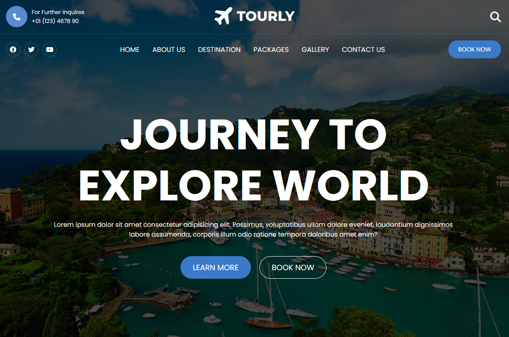

# Tourly - Journey to explore world!

This is a website inspired by the film [Travel Website](https://www.youtube.com/watch?v=FYFmQEpZywc&t=2s&ab_channel=codewithsadee). We used the idea to create this page as well as the photo. THIS IS NOT REAL WEBSITE.

# 📝 Table of contents

-   [Overview](#overview)
-   [Live demo](#live-demo)
-   [Screenshot](#screenshot)
-   [Tech stack](#tech-stack)
-   [Author](#author)

# ✏️ Overview

Users should be able to:

-   change size of website and look how layout change,
-   contact with the owner of the travel agency

# 🟢 Live demo [Tourly](https://silly-brigadeiros-0175f6.netlify.app/)

# 📷 Screenshot

## Built with

# 🔗 Author

